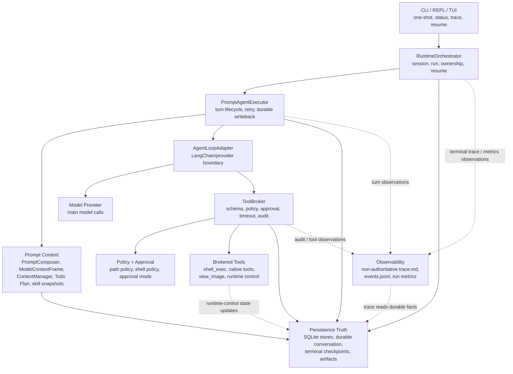
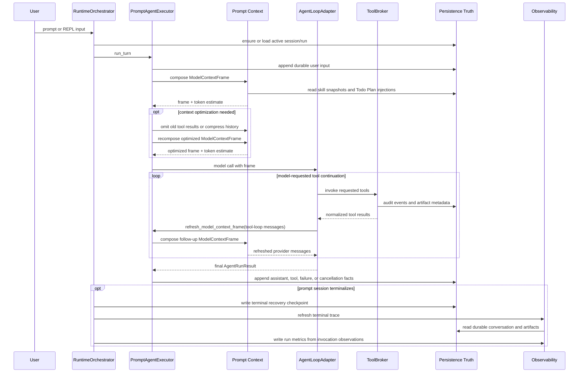
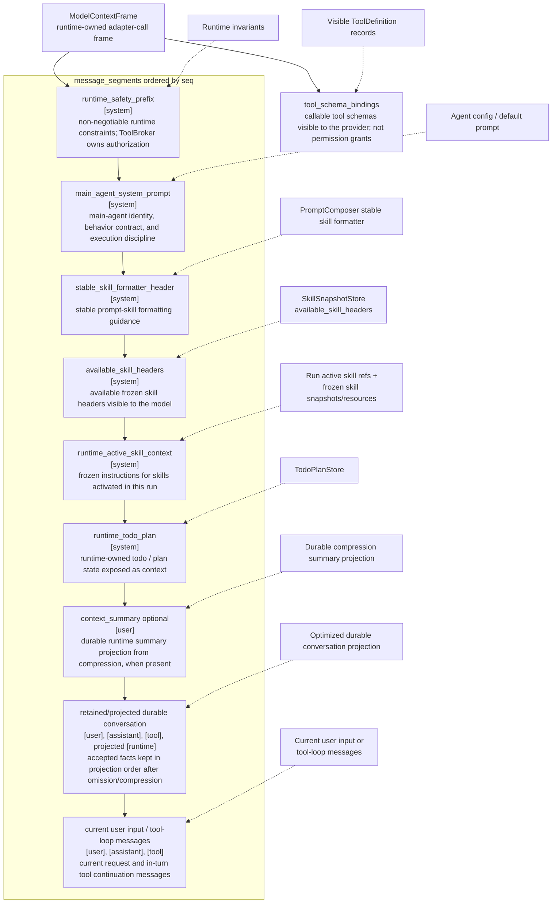

# RenderDoc-Debug-Agent

RenderDoc-Debug-Agent is a local agent runtime for RenderDoc-assisted GPU frame
debugging.

It helps drive controlled `rdc` command sequences, inspect exported render
targets and textures, preserve debugging traces, and resume long-running local
debugging sessions. The project focuses on RenderDoc frame analysis, not shader
source-level debugging or automatic shader patch generation.

## Overview

RenderDoc-Debug-Agent is built for local debugging tasks where an agent needs to
use real tools over a real workspace while keeping execution auditable and
recoverable.

The runtime provides:

- session and run lifecycle management;
- controlled model-visible tools through a brokered execution boundary;
- prompt skill activation and frozen skill resource loading;
- local shell execution through structured argv, path policy, shell policy,
  approval, timeout, artifact handling, and audit;
- image inspection through a brokered `view_image` tool;
- durable conversation, trace rendering, run metrics, and explicit resume.

## Architecture

The runtime is organized around one rule: debug-agent owns runtime state and
tool execution. The model provider is called through an adapter, and every
model-visible tool call crosses the brokered safety boundary.



`RuntimeOrchestrator` owns session and run lifecycle. `PromptAgentExecutor` owns
each agent turn. `AgentLoopAdapter` integrates the model provider, but it does
not own sessions, checkpoints, tool policy, artifacts, or recovery state.

Within one turn, debug-agent repeatedly rebuilds model-visible context from
runtime facts. Tool results can refresh the frame before the next model call,
while accepted outputs and failures are written back as durable conversation
facts.



This flow is intentionally recovery-oriented. The runtime persists accepted
facts, not partial provider streams or hidden reasoning. Resume uses durable
conversation plus terminal recovery checkpoints rather than replaying in-flight
model or tool state.

`ModelContextFrame` is the runtime-owned LLM-visible request frame sent to the
model adapter. It is assembled from runtime-owned sources on each model call.
The adapter materializes provider-legal messages and provider-native tool
bindings from the frame; the provider does not receive raw database rows,
unbounded chat history, or the frame object verbatim.



## Core Features

### Agent Runtime

- **Interactive and one-shot execution**: run `debug-agent` as a REPL or execute
  one prompt with `debug-agent -p`.
- **Prompt skills**: discover, freeze, activate, and load resources from local
  prompt skills without giving the model raw filesystem access to skill source
  directories.
- **Runtime-owned context**: build model-visible context through
  `ModelContextFrame`, with token-budget estimation, old tool-result omission,
  automatic context compression, and manual `/compress`.
- **Todo Plan continuity**: keep a runtime-owned plan for long multi-step
  debugging tasks, independent of natural-language conversation history.
- **Main-agent thinking mode**: optionally request provider thinking for main
  agent calls while discarding thinking blocks from durable, visible, and replay
  paths.

### Tooling And Safety

- **Brokered tools**: route all model-visible tool calls through `ToolBroker`
  for schema validation, policy checks, approval, execution, artifact handling,
  result normalization, and audit.
- **Controlled shell execution**: run commands as structured argv through
  `shell_exec`, with `shell=False`, path policy, shell policy, timeout, and
  approval.
- **Native file tools**: expose brokered `find_file`, `read_file`, `list_dir`,
  `search_text`, `write_file`, and `edit_file` with structured results,
  pagination, path policy, and stale-write protection for file writes.
- **Image inspection**: inspect local PNG/JPEG outputs through `view_image`
  when multimodal configuration is enabled.
- **Approval and policy boundary**: combine trusted/denied path roots,
  shell-command allow/deny rules, approval modes, and audit records before any
  model-requested side effect is executed.

### Continuity And Recovery

- **Durable conversation**: persist accepted user, assistant, tool, failure, and
  cancellation facts as runtime-owned conversation truth.
- **Normalized failure handling**: use centralized `error_class` and `reason`
  symbols for model, tool, config, policy, persistence, runtime, and
  cancellation failures.
- **Narrow retry and continuation**: support opt-in runtime-owned transient
  retry and `output_token_limit_reached` continuation without generic step
  retry, tool replay, or token-level resume.
- **Session control**: support running-turn cancellation, best-effort provider
  and shell cancellation, idle terminalization, explicit resume, and
  user-confirmed stale owner fail-close.
- **Terminal recovery checkpoints**: resume only from eligible terminal prompt
  sessions using durable conversation facts and checkpoint-frozen runtime state.

### Observability And Evaluation

- **Trace rendering**: write human-readable conversation traces under
  `.sessions/<session_id>/logs/trace.md`.
- **Event stream**: write non-authoritative runtime diagnostics and run events
  to `.sessions/<session_id>/logs/events.jsonl`.
- **Run metrics**: write non-authoritative per-invocation timing, token, and
  tool stability metrics for review and offline evaluation.

### RenderDoc Readiness

- **Scripted RenderDoc access**: support short, structured `rdc` command
  sequences through brokered `shell_exec`.
- **Visual frame inspection**: inspect exported render targets and textures
  through brokered `view_image`.
- **Package deployment smoke**: support installation as a console script through
  `uv tool install`, then run from a normal workspace with `debug-agent`.

### Current Boundaries

- RenderDoc frame analysis is supported; shader source-level debugging is not.
- The runtime can produce structured diagnostic reports, but it does not
  generate or validate shader source patches.
- The project is a local debugging runtime, not a general-purpose agent
  platform.
- RenderDoc and `rdc` procedure choices belong to prompt skills and user tasks,
  not to hard-coded runtime core logic.

## Quick Start

### Platform Requirements

- Python 3.11 or newer.
- [`uv`](https://docs.astral.sh/uv/) for installation and development commands.
- Windows or Linux for the real local RenderDoc workflow. This is because the
  current `rdc-cli` local capture/replay path supports Windows and Linux; macOS
  is limited to Split client workflows in `rdc-cli`.
- RenderDoc and `rdc` are required for real RenderDoc capture analysis. They are
  not required for ordinary unit tests or fake readiness tests.

### Install The CLI

Install from a local checkout:

```bash
uv tool install /path/to/repo
```

After installation, use the console script directly:

```bash
debug-agent --help
```

### Configure the Model Provider

Create the user config file:

- Windows: `%USERPROFILE%\.debug-agent\config.toml`
- Linux: `~/.debug-agent/config.toml`

Minimal real-provider configuration:

```toml
[defaults]
# Main model provider. The current real provider path is Anthropic-compatible.
provider = "anthropic"

# Main model name passed to the provider adapter.
model = "kimi-k2.5"

# Sampling temperature for main model calls.
temperature = 0.2

# Maximum output tokens for main model calls.
max_tokens = 8192

# Main model request timeout in seconds.
timeout_seconds = 120

[auth.anthropic]
# Environment variable that stores the provider API key.
api_key_env = "ANTHROPIC_API_KEY"

[providers.anthropic]
# Environment variable that stores the Anthropic-compatible base URL.
base_url_env = "ANTHROPIC_BASE_URL"
```

Set the provider environment variables.

Windows PowerShell:

```powershell
$env:ANTHROPIC_API_KEY = "<secret>"
$env:ANTHROPIC_BASE_URL = "https://api.moonshot.cn/anthropic"
```

Linux:

```bash
export ANTHROPIC_API_KEY="<secret>"
export ANTHROPIC_BASE_URL="https://api.moonshot.cn/anthropic"
```

For a fully annotated configuration template, see
[`docs/templates/config.toml`](docs/templates/config.toml).

### Configure Tool Policy

Create the user policy file:

- Windows: `%USERPROFILE%\.debug-agent\agent.toml`
- Linux: `~/.debug-agent/agent.toml`

Minimal policy configuration:

```toml
[[path_policies]]
# Additional trusted roots. The current workspace root is trusted by default.
scope = "trust"
paths = ["."]

[[path_policies]]
# Additional hard-denied paths. Denies cannot be overridden by approval mode.
scope = "deny"
paths = ["secrets/", ".env"]

[shell_policy]
# Empty allow means no user allowlist restriction after builtin denies, path
# policy, approval, timeout, artifact handling, and audit.
allow = []

# Deny direct git access from model-initiated shell commands.
deny = [["git"]]
```

For a fully annotated policy template, see
[`docs/templates/agent.toml`](docs/templates/agent.toml).

### Install RenderDoc and `rdc`

RenderDoc and `rdc` are required for real RenderDoc capture analysis. They are
not required for ordinary unit tests or fake readiness tests.

For local RenderDoc replay, use Windows or Linux. macOS is not a current target
for this project's real local RenderDoc workflow because `rdc-cli` documents
macOS as Split client only.

This project builds on the surrounding RenderDoc agent tooling ecosystem:

- [`renderdoc-skill`](https://github.com/rudybear/renderdoc-skill): a RenderDoc
  GPU frame debugging skill.
- [`rdc-cli`](https://github.com/BANANASJIM/rdc-cli): a scriptable CLI for
  RenderDoc captures, terminal workflows, CI pipelines, and AI agents.

### Run the Agent

Start an interactive REPL:

```bash
debug-agent
```

Run one prompt:

```bash
debug-agent -p "Analyze this RenderDoc frame debugging case."
```

Select an approval mode explicitly:

```bash
debug-agent --approval-mode semi-auto -p "Inspect the exported frame images."
```

### Inspect a Session

```bash
debug-agent status <session_id>
debug-agent trace <session_id>
debug-agent resume <session_id>
```

### Development From Source

For local development inside this repository:

```bash
uv sync
uv run debug-agent --help
```

### Verify the Project

```bash
uv run pytest tests/unit -v
uv run pytest tests/integration -v
uv run pytest -v
```

Use the full test command before changing runtime behavior. For quick local
checks, run the narrower unit or integration suite first.

## Design Highlights

- **Runtime-owned truth**: sessions, runs, durable conversation, checkpoints,
  artifacts, Todo Plan state, and tool audit facts are runtime contracts.
- **Runtime-owned context**: model-visible context is assembled from structured
  runtime facts, with compression and Todo Plan injection handled outside the
  model's natural-language memory.
- **ToolBroker boundary**: every model-visible tool call passes through one
  execution envelope for schema validation, policy, approval, timeout, artifact
  handling, result normalization, and audit.
- **Normalized failure semantics**: failure handling, retry decisions,
  terminalization, and resume eligibility are driven by centralized
  `error_class` and `reason` symbols.
- **Recovery over replay**: resume restores eligible terminal prompt sessions
  from durable conversation facts and terminal recovery checkpoints; it does not
  replay accepted model calls, token streams, or mid-flight tool state.
- **Prompt skill separation**: domain procedure lives in prompt skills; runtime
  core provides the platform boundary and does not hard-code RenderDoc, `rdc`,
  shader, or report-schema business state machines.
- **Adapter isolation**: LangChain is used behind `AgentLoopAdapter`, so agent
  framework behavior does not redefine runtime state or policy.
- **Non-authoritative UI and metrics**: streaming UI, `trace.md`, and
  `events.jsonl`, and `run_metrics_*.json` are observation and review surfaces,
  not recovery truth.

## Evaluation

The project uses a lightweight evaluation framework for RenderDoc frame
analysis. It measures whether the agent can complete analysis, produce a
schema-valid `debug_report.json`, locate likely issue positions, and report
runtime cost.

The current evaluation focuses on RenderDoc frame analysis. It does not claim
shader source localization, automatic patch generation, or regression
validation.

### Business Metrics

| Metric | Meaning | Current Result |
| --- | --- | --- |
| Analysis completion rate | Runs that produce `debug_report.json` | TBD |
| Debug report schema valid rate | Completed reports that pass JSON schema validation | TBD |
| Issue location Top-1 hit rate | Highest-confidence candidate matches ground truth `eid + stage` | TBD |
| Issue location Top-3 hit rate | Any of the top 3 candidates matches ground truth `eid + stage` | TBD |

### Technical Metrics

| Metric | Meaning | Current Result |
| --- | --- | --- |
| Token per valid report | Average total tokens for schema-valid reports | TBD |
| Time per valid report | Average wall time for schema-valid reports | TBD |
| Tool failure rate | Failed tool calls divided by total tool calls | TBD |

An offline aggregation script can read `logs/<run>/results.csv` and write
`logs/<run>/eval.csv` for run-level summaries.

## Project Structure

```text
src/debug_agent/
  adapters/        Model and vision provider adapters.
  cli/             CLI entrypoint, REPL, TUI, and user-facing commands.
  observability/   Trace rendering and review-oriented outputs.
  persistence/     SQLite stores, checkpoints, artifacts, and schema gates.
  runtime/         Orchestration, config, policy, prompt execution, resume.
  tools/           ToolBroker, native tools, shell execution, view_image.

docs/
  project-contract.md
  adr/
  phase-*/
  templates/

tests/
  unit/
  integration/
```

### Current Scale

At the time of this README:

- `src/`: 58 Python files, about 25k non-empty non-comment lines.
- `tests/`: 68 Python test files, 819 test cases.

## Further Reading

- [`docs/project-contract.md`](docs/project-contract.md)
- [`docs/adr/overview.md`](docs/adr/overview.md)
