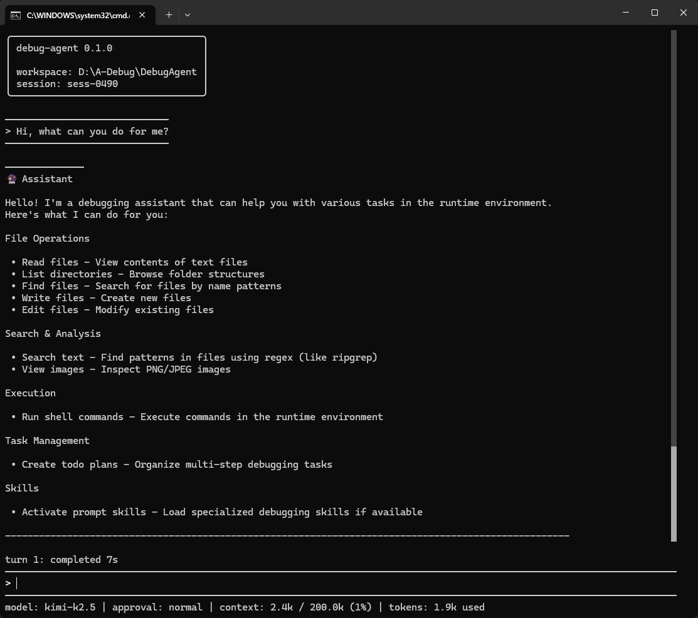
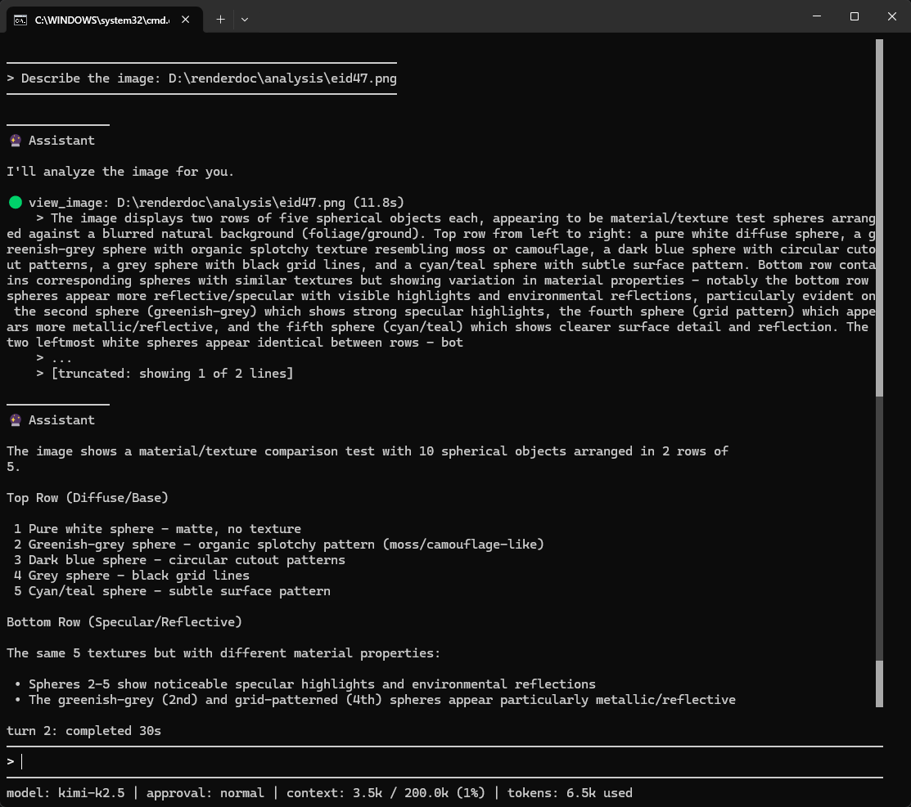
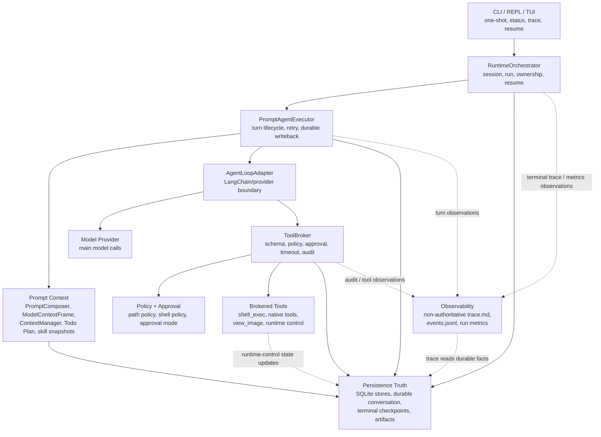

# RenderDoc-Debug-Agent

RenderDoc-Debug-Agent is a local long-running agent runtime for GPU frame
debugging.

**Tech Stack**: Python | LangChain | Agent Skill | Tool Calling | Multimodal Vision | SQLite

## Overview

This project targets RenderDoc GPU frame debugging workflows. Given a RenderDoc
capture sample with rendering anomalies, the runtime combines a RenderDoc prompt
skill, brokered command-line tool calls, exported render target/texture
artifacts, and multimodal image observation to locate likely root causes and
produce structured debugging reports.

The runtime is designed for real local tools and filesystems, long-running and
failure-prone debugging sessions, recoverable state, context compression, and a
single safety boundary for shell, file, runtime-control, and vision tools.

### REPL TUI





## Architecture

The runtime is organized around one rule: debug-agent owns runtime state and
tool execution. The model provider is called through an adapter, and every
model-visible tool call crosses the brokered safety boundary. For detailed turn
flow and context-frame rationale, see
[`docs/adr/overview.md`](docs/adr/overview.md).



`RuntimeOrchestrator` owns session and run lifecycle. `PromptAgentExecutor` owns
each agent turn. `AgentLoopAdapter` integrates the model provider, but it does
not own sessions, checkpoints, tool policy, artifacts, or recovery state.

## Features

- **Prompt Skill Runtime**: discover, freeze, activate, and inject local prompt
  skills while loading resource files only through brokered
  `load_skill_resource`.
- **Runtime-Owned Context And Compression**: assemble model-visible context
  through `ModelContextFrame`, estimate token budgets, omit old tool results,
  and support automatic compression plus manual `/compress`.
- **Todo Plan Continuity**: preserve a runtime-owned plan for long debugging
  tasks instead of relying on natural-language chat history.
- **Brokered Tool Calling**: route native file tools and structured
  `shell_exec` through `ToolBroker` for schema validation, path/shell policy,
  approval, timeout, artifact handling, result normalization, and audit.
- **Multimodal Vision**: inspect local PNG/JPEG outputs through brokered
  `view_image` when multimodal configuration is enabled.
- **Durable Recovery And Session Control**: persist accepted conversation
  facts, write terminal recovery checkpoints, support explicit resume,
  cancellation, normalized failures, and narrow runtime retry/continuation.
- **Observability And Evaluation**: render `trace.md`, write `events.jsonl`,
  and emit non-authoritative `run_metrics_*.json` timing, token, and tool
  metrics.

Current boundaries:

- RenderDoc frame analysis is supported; shader source-level debugging and
  automatic shader patch generation are not.
- The project is a local debugging runtime, not a general-purpose agent
  platform.
- RenderDoc and `rdc` procedure choices belong to prompt skills and user tasks,
  not to hard-coded runtime core logic.

## Quick Start

### Platform Requirements

- Python 3.11 or newer.
- [`uv`](https://docs.astral.sh/uv/) for installation and development commands.
- Windows or Linux for the real local RenderDoc workflow. This is because the
  current `rdc-cli` local capture/replay path supports Windows and Linux; macOS
  is limited to Split client workflows in `rdc-cli`.
- [RenderDoc](https://github.com/baldurk/renderdoc) and
  [`rdc-cli`](https://github.com/BANANASJIM/rdc-cli) are required for real
  RenderDoc capture analysis. They are not required for ordinary unit tests or
  fake readiness tests.

### Install

Install from a local checkout:

```bash
uv tool install /path/to/repo
```

After installation, use the console script directly:

```bash
debug-agent --help
```

### Configure the Model Provider

Create the user config file:

- Windows: `%USERPROFILE%\.debug-agent\config.toml`
- Linux: `~/.debug-agent/config.toml`

Minimal real-provider configuration:

```toml
[defaults]
provider = "anthropic"
model = "kimi-k2.5"
temperature = 0.2
max_tokens = 8192
timeout_seconds = 120

[auth.anthropic]
api_key_env = "ANTHROPIC_API_KEY"

[providers.anthropic]
base_url_env = "ANTHROPIC_BASE_URL"
```

Set the provider environment variables.

Windows PowerShell:

```powershell
$env:ANTHROPIC_API_KEY = "<secret>"
$env:ANTHROPIC_BASE_URL = "https://api.moonshot.cn/anthropic"
```

Linux:

```bash
export ANTHROPIC_API_KEY="<secret>"
export ANTHROPIC_BASE_URL="https://api.moonshot.cn/anthropic"
```

For a fully annotated configuration template, see
[`docs/templates/config.toml`](docs/templates/config.toml).

### Configure Tool Policy

Create the user policy file:

- Windows: `%USERPROFILE%\.debug-agent\agent.toml`
- Linux: `~/.debug-agent/agent.toml`

Minimal policy configuration:

```toml
[[path_policies]]
scope = "trust"
paths = ["."]

[[path_policies]]
scope = "deny"
paths = ["secrets/", ".env"]

[shell_policy]
allow = []
deny = [["git"]]
```

For a fully annotated policy template, see
[`docs/templates/agent.toml`](docs/templates/agent.toml).

In the REPL, enter `/tools` to inspect all currently available tools and the
active path policy and shell policy configuration.

### Configure Prompt Skills

Prompt skills are discovered from direct child directories under these roots:

- Project skills: `<workspace_root>/.debug-agent/skills/`
- Global user skills: `~/.debug-agent/skills/`

Each skill directory must contain a `SKILL.md`. Project skills override
same-name global skills as whole skills. Skill source is snapshotted and frozen
when a session starts, so editing a skill file does not affect an already
running session.

In an interactive REPL, use `/skills` to inspect discovered and active skills.
In one-shot or REPL prompts, ask the agent to use the relevant skill, for
example:

```bash
debug-agent --approval-mode semi-auto -p "Use the renderdoc-gpu-debug skill to inspect this frame capture."
```

### Run the Agent

Start an interactive REPL:

```bash
debug-agent
```

Run one prompt:

```bash
debug-agent -p "Analyze this RenderDoc frame debugging case."
```

Select an approval mode explicitly:

```bash
debug-agent --approval-mode semi-auto -p "Inspect the exported frame images."
```

### Inspect a Session

```bash
debug-agent status <session_id>
debug-agent trace <session_id>
debug-agent resume <session_id>
```

### Development From Source

For local development inside this repository:

```bash
uv sync
uv run debug-agent --help
```

### Verify the Project

```bash
uv run pytest tests/unit -v
uv run pytest tests/integration -v
uv run pytest -v
```

Use the full test command before changing runtime behavior. For quick local
checks, run the narrower unit or integration suite first.

## Evaluation

The project uses a lightweight evaluation framework for RenderDoc frame
analysis. It measures whether the agent can complete analysis, produce a
schema-valid `debug_report.json`, locate likely issue positions, and report
runtime cost.

The results below were measured on an internal evaluation dataset with 56
samples.

| Metric | Ours (debug-agent + kimi-k2.5) | Comparison ([codely](https://codely.tuanjie.cn/) + opus4.8) |
| --- | --- | --- |
| Samples | 56 | 56 |
| Analysis completion rate | 100% | 100% |
| Debug report schema valid rate | 100% | 100% |
| Issue location Top-1 hit rate | 60.7% (34/56) | 69.6% (39/56) |
| Issue location Top-3 hit rate | 80.4% (45/56) | 82.1% (46/56) |
| Average time per valid report | 476s (7m56s) | 944s (15m44s) |
| Average tokens per valid report | 2.1M | 2.7M |
| Average tool calls per valid report | 90.1 | 86.8 |

## Project Structure

```text
.
├── src/
│   └── debug_agent/
│       ├── adapters/        Model and vision provider adapters.
│       ├── cli/             CLI entrypoint, REPL, TUI, and user-facing commands.
│       ├── observability/   Trace rendering and review-oriented outputs.
│       ├── persistence/     SQLite stores, checkpoints, artifacts, and schema gates.
│       ├── runtime/         Orchestration, config, policy, prompt execution, resume.
│       └── tools/           ToolBroker, native tools, shell execution, view_image.
├── docs/
│   ├── project-contract.md  Product behavior, architecture, and contract truth.
│   ├── adr/                 Accepted architecture decision records.
│   ├── phase-*/             Phase scope, specs, tests, operations, and plans.
│   └── templates/           Annotated config and policy templates.
└── tests/
    ├── unit/                Focused module and contract tests.
    └── integration/         Runtime flow, tool, readiness, and smoke tests.
```

Current scale: `src/` has 58 Python files and about 25k non-empty non-comment
lines; `tests/` has 68 Python test files and 819 test cases.

## Further Reading

- [`docs/project-contract.md`](docs/project-contract.md)
- [`docs/adr/overview.md`](docs/adr/overview.md)
